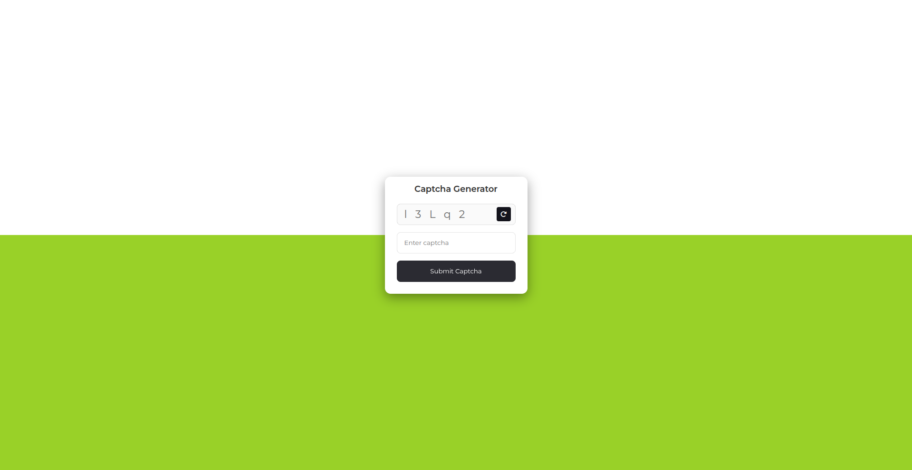

# 🔐 Gjenerues Custom Captcha (JavaScript) 🇦🇱

> Gjenerues i lehtë custom CAPTCHA në JavaScript vanilla — kode të rastësishme të shtrembëruara në canvas, rifreskim dhe verifikim.

**🔴 Demo live:** https://erionnezha.github.io/Custom-Captcha-Generator/

## ⚙️ Karakteristikat

- Kodi captcha i rastësishëm i vizatuar me shtrembërim vizual
- 🔄 Butoni i rifreskimit për të gjeneruar një kod të ri
- ✅ Dërgo për të verifikuar captcha-n e futur
- JavaScript i pastër vanilla — pa librari, pa build

## ▶️ Ekzekuto lokalisht

Hap `index.html` në çdo shfletues.

## 📄 Licenca

Copyright © 2026 Erion Nezha. Të gjitha të drejtat e rezervuara. Shih [LICENSE](LICENSE).

---

# 🔐 Custom Captcha Generator (JavaScript) 🇬🇧

> A lightweight custom CAPTCHA generator in vanilla JavaScript — distorted random codes on canvas, refresh and verify.

**🔴 Live demo:** https://erionnezha.github.io/Custom-Captcha-Generator/

## ⚙️ Features

- Random captcha code rendered with visual distortion
- 🔄 Refresh button to generate a new code
- ✅ Submit to verify the entered captcha
- Pure vanilla JS — no libraries, no build step

## ▶️ Run locally

Open `index.html` in any browser.

## 📄 License

Copyright © 2026 Erion Nezha. All rights reserved. See [LICENSE](LICENSE).
